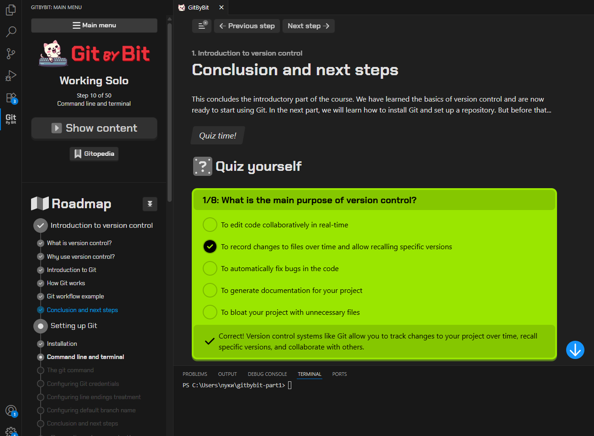

# Звіт про виконання Лабораторно-практичної роботи №1

**Тема:** Проходження інтерактивного курсу «Git How To»

## 1. Опис виконаного завдання

Під час виконання лабораторної роботи я пройшов інтерактивний навчальний курс «Git How To». Метою роботи було ознайомлення з базовими командами та принципами роботи системи контролю версій Git та формування практичних навичок для виконання основних операцій у консолі.

## 2. Пройдені частини курсу

**Було пройдено:** Частина 1 (Базові операції).

Курс охопив наступні теми:
* Ініціалізація репозиторію
* Додавання та коміти файлів
* Перегляд історії
* Скасування змін
* Робота з гілками

Усі кроки курсу зафіксовані за допомогою скріншотів, які знаходяться у папці `screenshots` цього репозиторію.
---

---
### Висновок
Перша частина курсу була успішно завершена. Отримано початкові практичні навички роботи з Git для створення та управління репозиторіями.
